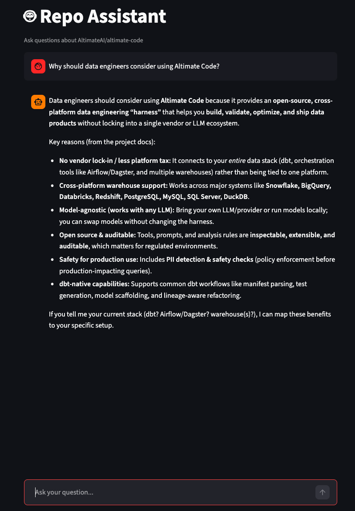
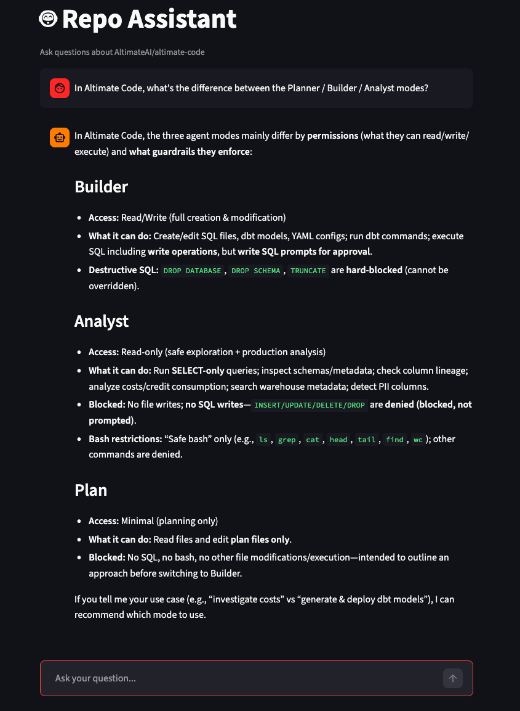

# Repo Assistant

Personal AI assistant for documentation and code:

- A repository-aware agent
- Ingests GitHub docs, chunks and indexes them
- Answers questions with tool-backed search, evaluates its own quality
- Provides a local Streamlit chat UI

## Highlights

- GitHub repository ingestion from zip archives
- Markdown / MDX parsing with frontmatter support
- Sliding-window and section-based chunking
- Lexical, vector, and hybrid search
- Pydantic AI repository Q&A agent
- Interaction logging and LLM-as-a-judge evaluation
- Local Streamlit chat application
- End-to-end workflow driven by `just` CLI

## Example target

Current implementation is configured for the repo of Altimate Code, an open-source tool for AI-powered data engineering:

- [AltimateAI/altimate-code](https://github.com/AltimateAI/altimate-code)

## Demo





## Evaluation

Automated evaluation baseline on AI-generated questions:

- `answer_clear`: `10/10`
- `answer_grounded`: `10/10`
- `answer_relevant`: `10/10`
- `instructions_follow`: `10/10`
- `tool_call_search`: `10/10`

Detailed evaluation artefacts are generated under `_data/` and interaction logs under `logs/`.

## Ops

This project is operated through the root `justfile`.
```
Available recipes:
    agent-q                          # Ask the repository agent a default question.
    agent-q-custom question          # Ask the repository agent a custom question.
    app                              # Run the local Streamlit app.
    chunk-json                       # Show full JSON sliding chunk output.
    chunk-preview limit="5"          # Preview a few sliding-window chunks.
    chunk-sections                   # Create section-based chunks and save them to disk.
    chunk-sections-json              # Show full JSON section chunk output.
    chunk-sections-preview limit="5" # Preview a few section-based chunks.
    chunk-sections-where             # Show saved section chunk output path.
    chunk-sliding                    # Create sliding-window chunks and save them to disk.
    chunk-where                      # Show saved sliding chunk output path.
    counts                           # Show summary counts for processed markdown docs.
    eval-generate-questions          # Generate evaluation questions from sampled repository chunks.
    eval-log                         # Evaluate the default saved agent interaction log.
    eval-log-file log_file           # Evaluate a specific saved agent interaction log.
    eval-logs                        # Evaluate all saved agent interaction logs in the logs directory.
    eval-logs-ai                     # Evaluate only AI-generated agent interaction logs.
    eval-logs-ai-save                # Evaluate only AI-generated logs and save detailed results.
    eval-run-questions               # Run generated evaluation questions through the agent and save run results.
    help                             # This menu
    json                             # Full JSON output for debugging.
    preview limit="5"                # Preview a few processed records.
    save                             # Save processed repository data to disk and show summary counts.
    search-hybrid                    # Run a default hybrid search query against sliding-window chunks.
    search-hybrid-json               # Show full JSON results for the default hybrid search query.
    search-hybrid-q query            # Run a custom hybrid search query against sliding-window chunks.
    search-text                      # Run a default lexical search query against sliding-window chunks.
    search-text-json                 # Show full JSON results for the default lexical search query.
    search-text-q query              # Run a custom lexical search query against sliding-window chunks.
    search-vector                    # Run a default vector search query against sliding-window chunks.
    search-vector-json               # Show full JSON results for the default vector search query.
    search-vector-q query            # Run a custom vector search query against sliding-window chunks.
    tree                             # Repo structure
    where                            # Preview saved repository data file path.
```


## Spec

Detailed implementation notes and day-by-day project breakdown:

- [Project spec](./aihero/project/README.md)

## Repo structure

- `aihero/project/src/` — implementation code
- `justfile` — operational commands
- `_data/` — generated data artefacts
- `logs/` — interaction and evaluation logs

## Tech stack

- Python
- uv
- Just
- minsearch
- sentence-transformers
- Pydantic AI
- Streamlit

## License

[LICENSE](LICENSE)
